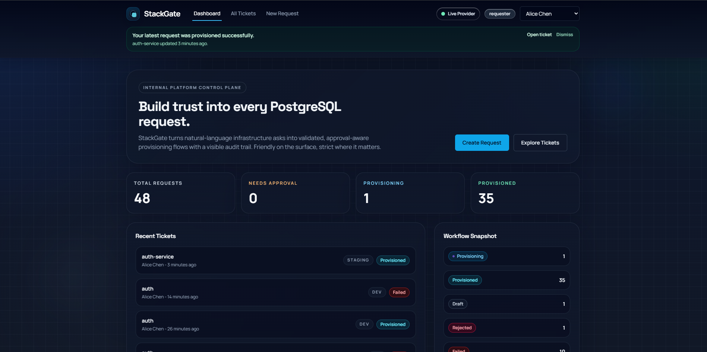
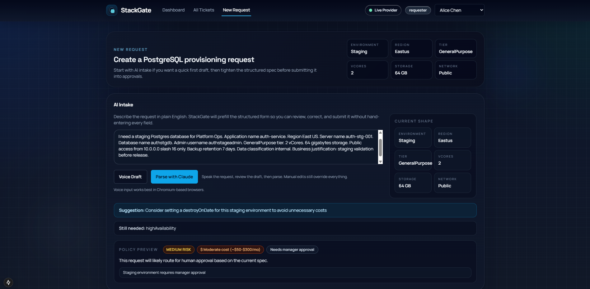
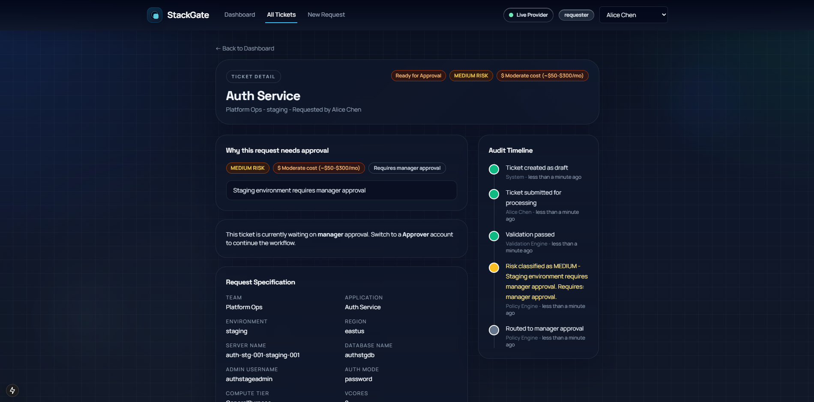
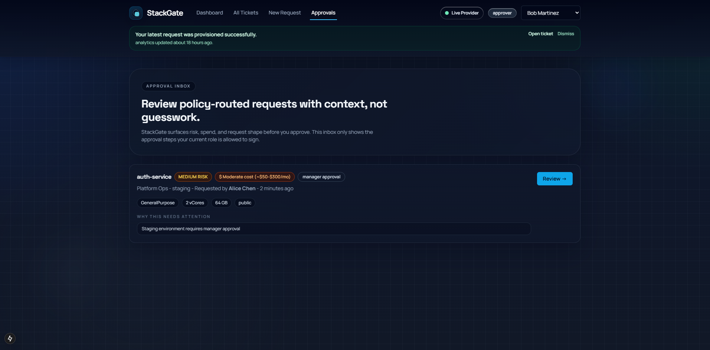
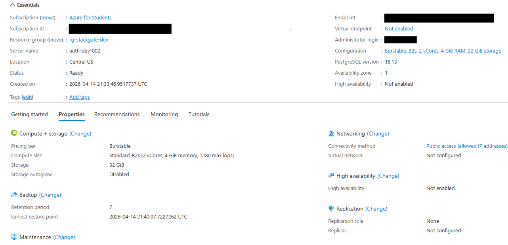

# StackGate

StackGate is an AI-assisted internal developer platform for PostgreSQL requests. It turns plain-English infrastructure asks into structured specs, validates them, classifies risk, routes approvals, and provisions resources with a visible audit trail.

The goal is to feel like a real internal platform product, not a CRUD demo: request intent goes in, policy-aware workflow and provisioning outcomes come out.

## Highlights

- Natural-language intake powered by Anthropic Claude with a deterministic fallback parser.
- Policy engine that classifies low, medium, and high-risk requests based on cost, environment, data sensitivity, and networking.
- Role-based workflow with requester, approver, and admin experiences.
- Approval routing with rationale, comments, and ticket-level audit history.
- Simulation-first provisioning flow for safe demos.
- Guarded Azure live provisioning path for a narrow low-risk dev profile.
- Resource handoff card with connection details once provisioning completes.

## Product Flow

1. A requester describes a database need in plain English.
2. StackGate parses the request into a structured PostgreSQL spec.
3. Validation checks for missing or invalid fields before provisioning can begin.
4. The policy engine assigns a risk and cost band and decides whether the request auto-approves or routes for human review.
5. Approvers review the request with inline rationale and audit context.
6. Provisioning runs asynchronously in simulation mode or, for a guarded low-risk slice, in live Azure mode.
7. The ticket records milestones and surfaces the final provisioned resource details.

## Demo Walkthrough

### 1. Dashboard Overview

The dashboard frames StackGate as an internal platform rather than a form-only app. It surfaces workflow health, recent requests, and the current provider mode at a glance.



### 2. AI Intake and Policy Preview

Requesters start with a plain-English description. StackGate parses the prompt into a structured spec and previews the likely policy outcome before submission.



### 3. Approval-Routed Medium-Risk Ticket

Medium-risk requests stay visible and explainable. The ticket detail page shows why the request was routed for approval instead of auto-approved.



### 4. Approval Inbox

Approvers review policy-routed requests with enough context to act quickly without digging through raw infrastructure details.



### 5. Live Azure Proof

For a guarded low-risk profile, StackGate can provision a real Azure Database for PostgreSQL flexible server. Sensitive account details are redacted in the screenshot below.



## Feature Set

| Area | Included |
|---|---|
| Request intake | AI parsing, voice draft support, structured form editing |
| Policy | Validation, risk classification, cost banding, approval routing |
| Workflow | Auto-approval, manager approval, platform approval, audit trail |
| Provisioning | Simulation adapter, guarded Azure adapter, resource output card |
| UX | Dashboard, approvals inbox, ticket detail, policy preview, notifications banner |

## Tech Stack

| Layer | Choice |
|---|---|
| Framework | Next.js 15 App Router |
| Language | TypeScript |
| Styling | Tailwind CSS |
| Data layer | Prisma |
| Local metadata store | SQLite |
| AI parsing | Anthropic Claude API + deterministic fallback |
| Cloud provisioning | Simulation adapter + guarded Azure PostgreSQL adapter |

## Local Setup

```bash
npm install
npm run db:push
npm run db:seed
npm run dev
```

Then open [http://localhost:3000](http://localhost:3000).

## Environment Setup

Create a local `.env.local` from `.env.example` and fill in only the values you need for your machine.

Typical local simulation setup:

```env
DATABASE_URL="file:./dev.db"
ANTHROPIC_API_KEY="sk-ant-..."
NEXT_PUBLIC_APP_NAME="StackGate"
NEXT_PUBLIC_PROVISIONING_MODE="simulation"
STACKGATE_PROVISIONING_PROVIDER="simulation"
AZURE_ENABLE_LIVE_PROVISIONING="false"
AZURE_SUBSCRIPTION_ID=""
AZURE_RESOURCE_GROUP="rg-stackgate-dev"
AZURE_LOCATION="centralus"
AZURE_POSTGRES_VERSION="16"
```

`.env`, `.env.local`, and local database files are intentionally ignored from git.

## Guarded Azure Mode

StackGate ships with a guarded live Azure path for low-risk development requests. Everything else stays in simulation mode automatically.

To enable the Azure adapter locally:

```env
NEXT_PUBLIC_PROVISIONING_MODE="azure"
STACKGATE_PROVISIONING_PROVIDER="azure"
AZURE_ENABLE_LIVE_PROVISIONING="true"
AZURE_SUBSCRIPTION_ID="<your-subscription-id>"
AZURE_RESOURCE_GROUP="rg-stackgate-dev"
AZURE_LOCATION="centralus"
AZURE_POSTGRES_VERSION="16"
AZURE_CLI_PATH="C:\\Program Files\\Microsoft SDKs\\Azure\\CLI2\\wbin\\az.cmd"
```

The live Azure path is intentionally restricted to keep cost and blast radius low:

- environment must be `dev`
- compute tier must be `Burstable`
- vCores must be `1` or `2`
- storage must be `32 GB`
- high availability must be disabled
- networking must be `public`
- exactly one restricted CIDR must be provided
- data classification must be `internal`

Requests outside those bounds record a warning and fall back to simulation mode instead of provisioning live infrastructure.

## Demo Accounts

- `Alice Chen` - requester
- `Bob Martinez` - approver
- `Carol Singh` - admin

## Smoke Test

With the app running locally, you can execute the workflow smoke test:

```bash
npm test
```

That script submits low, medium, and high-risk requests and verifies the expected approval and provisioning behavior.

## Repo Notes

- This repository is safe to publish without local secrets as long as `.env` and `.env.local` stay uncommitted.
- README screenshots should focus on the product flow, not personal account details.
- Azure proof screenshots should redact subscription IDs, endpoints, and admin usernames.

## Roadmap

- Add retry and decommission operations for provisioned resources.
- Expand the provisioning adapter interface to support more providers beyond Azure simulation/live mode.
- Add persistent in-app notifications and unread state.
- Add architecture diagrams and demo assets to the README.
- Harden the live provider path with better cleanup, rollback, and budget-aware safeguards.
