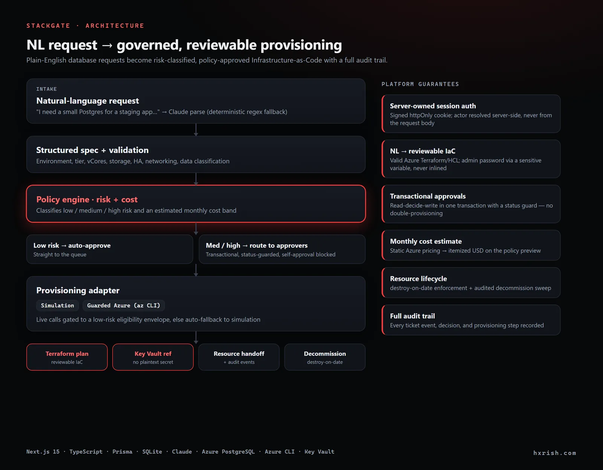
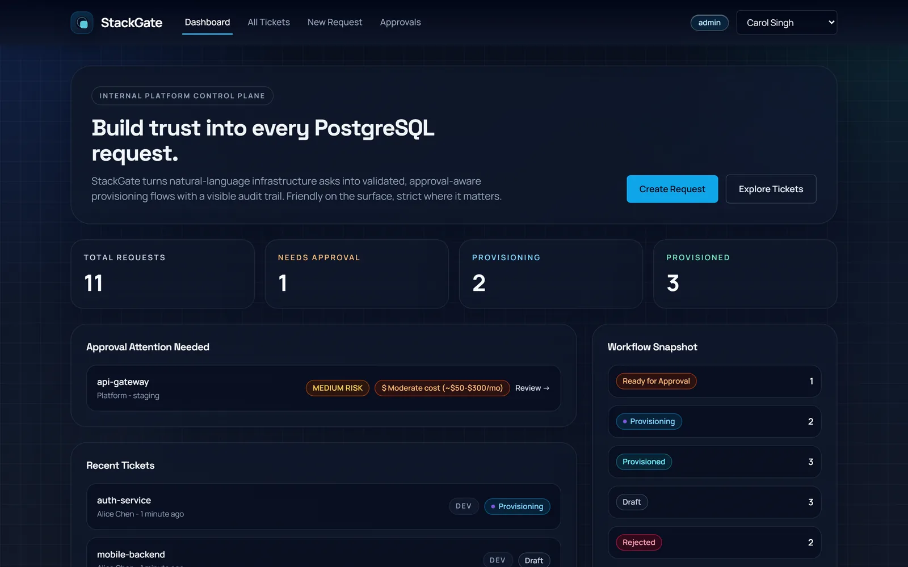
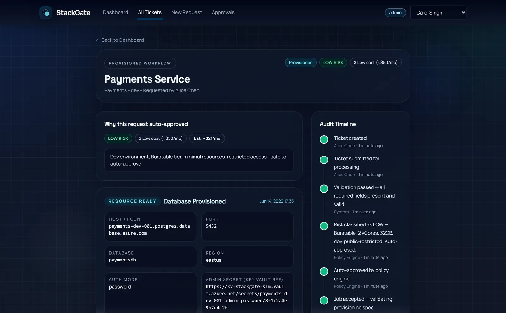
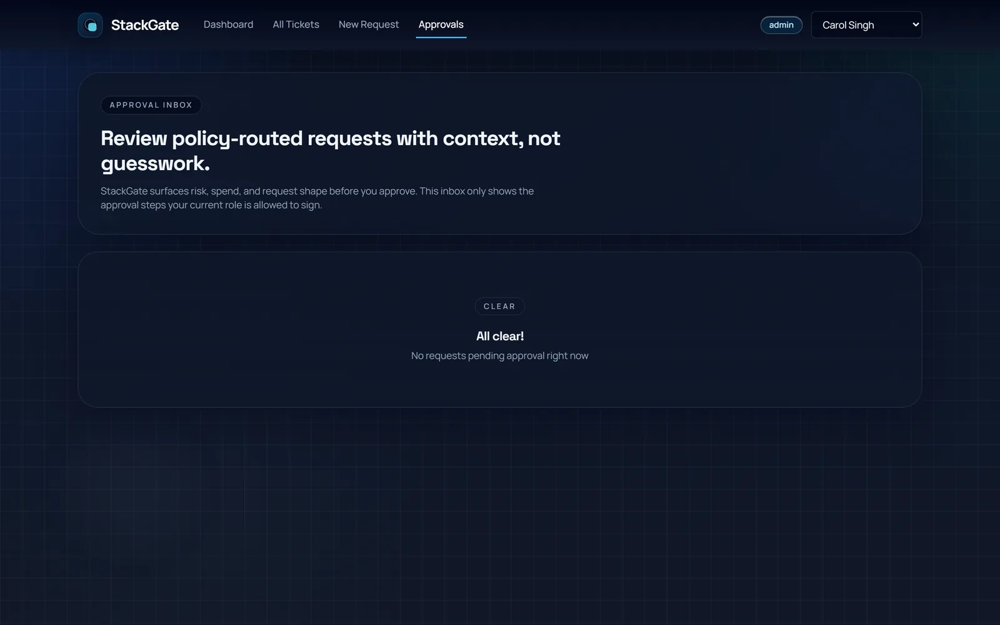

# StackGate

StackGate is an AI-assisted internal developer platform that turns natural language into **reviewable Infrastructure-as-Code**. A plain-English PostgreSQL ask becomes a structured spec, gets validated, risk- and cost-scored, routed for approval, rendered as a reviewable Terraform plan, and provisioned with a visible audit trail and lifecycle controls.

The goal is to feel like a real internal platform product, not a CRUD demo: request intent goes in, governed IaC and provisioning outcomes come out.

## System Snapshot



At a glance, StackGate takes a database request, structures it with AI, applies policy rules (risk + cost), routes approvals when needed, renders a reviewable Terraform plan, provisions the resource (storing a Key Vault secret reference, never the plaintext), and keeps the full workflow, including lifecycle decommission, visible in the ticket and dashboard.

## Highlights

- Natural-language intake powered by Anthropic Claude with a deterministic fallback parser.
- Natural language → reviewable Terraform (HCL): every request renders a valid Azure Terraform plan you can review and download before any apply.
- Policy engine that classifies low, medium, and high-risk requests based on cost, environment, data sensitivity, and networking.
- Static monthly cost estimate (USD) surfaced on the policy preview and ticket detail, with a compute/storage/backup/HA breakdown.
- Role-based workflow with requester, approver, and admin experiences.
- Approval routing with rationale, comments, and ticket-level audit history.
- Simulation-first provisioning flow for safe demos.
- Guarded Azure live provisioning path for a narrow low-risk dev profile.
- Resource lifecycle: destroy-on-date enforcement plus a manual/sweep decommission path (simulation-only teardown with audit entries).
- Secret handling through a Key Vault abstraction: provisioning stores only a vault reference (URI + secret id), never the plaintext password.
- Resource handoff card with connection details once provisioning completes.

## Product Flow

1. A requester describes a database need in plain English.
2. StackGate parses the request into a structured PostgreSQL spec.
3. Validation checks for missing or invalid fields before provisioning can begin.
4. The policy engine assigns a risk and cost band and decides whether the request auto-approves or routes for human review.
5. Approvers review the request with inline rationale and audit context.
6. Provisioning runs asynchronously in simulation mode or, for a guarded low-risk slice, in live Azure mode.
7. The ticket records milestones and surfaces the final provisioned resource details.

## Demo Walkthrough

### 1. Dashboard Overview

The dashboard frames StackGate as an internal platform rather than a form-only app: workflow health, recent requests, and approval attention with risk + cost bands at a glance.



### 2. Provisioned Ticket: Terraform, Cost, Key Vault, Lifecycle

A provisioned ticket shows the policy rationale and monthly cost estimate, the generated **Terraform plan** (view/download), a **Key Vault secret reference** (no plaintext password), the resource handoff, and a **decommission** action for destroy-on-date lifecycle control.



### 3. Approval Inbox

Approvers review policy-routed medium/high-risk requests with risk and cost context, enough to act quickly without digging through raw infrastructure details.



## Feature Set

| Area | Included |
|---|---|
| Request intake | AI parsing, voice draft support, structured form editing |
| Policy | Validation, risk classification, cost banding, approval routing |
| Workflow | Auto-approval, manager approval, platform approval, audit trail |
| IaC | NL → reviewable Terraform (HCL) plan, view + download per ticket |
| Cost | Static monthly USD estimate with compute/storage/backup/HA breakdown |
| Provisioning | Simulation adapter, guarded Azure adapter, resource output card |
| Lifecycle | Destroy-on-date enforcement, manual + sweep decommission (simulation teardown) |
| Secrets | Key Vault abstraction, stores a vault reference, never the plaintext password |
| UX | Dashboard, approvals inbox, ticket detail, policy preview, notifications banner |

## Infrastructure-as-Code, Cost, Lifecycle, and Secrets

### Natural language → reviewable Terraform

Every ticket can be rendered as a valid Azure Terraform plan (`lib/terraform.ts`) covering the resource group, PostgreSQL flexible server, database, an optional firewall rule, and tags (owner, team, environment, data classification, and `destroy_on`). The plan is review-first: the admin password is wired through a `sensitive` Terraform variable and never written into the file. View or download it from the ticket detail, or fetch it directly:

```
GET /api/tickets/:id/terraform            # inline text/plain HCL
GET /api/tickets/:id/terraform?download=1 # downloads <server>.tf
```

The route is auth-gated via the signed session (`getSessionUser`).

### Monthly cost estimate

`lib/cost.ts` holds a static Azure pricing map (per-vCore-hour by tier, per-GB storage, backup retention beyond the free window, plus an HA standby) and produces an itemized monthly USD estimate. It is surfaced on the policy/preview step and the ticket detail. **It is an estimate only**, real Azure billing varies by region, runtime, and reservations.

### Resource lifecycle: decommission / destroy-on-date

Specs carry a `destroyOnDate`. The decommission endpoint enforces it (simulation only, it never tears down real Azure infrastructure):

```
POST /api/maintenance/decommission { "ticketId": "..." }  # manual, one ticket
POST /api/maintenance/decommission {}                      # sweep all expired
```

Decommissioning marks the resource `decommissioned`, flips the ticket to `Decommissioned`, and writes an audit entry. Approvers and admins see a manual **Decommission** action on provisioned tickets.

### Secret handling via a Key Vault abstraction

`lib/secrets.ts` defines a `SecretStore` interface. The `SimulationSecretStore` returns a *reference*, an Azure Key Vault-style URI (`https://<vault>.vault.azure.net/secrets/<name>/<version>`) plus a secret id, instead of the plaintext password. Provisioning generates the DB password, hands it to the store, and persists only the reference on the resource. The plaintext is never written to the database or the audit log. The production implementation (Azure Key Vault via `@azure/keyvault-secrets` + `@azure/identity`) is documented in comments in that module.

## Tech Stack

| Layer | Choice |
|---|---|
| Framework | Next.js 15 App Router |
| Language | TypeScript |
| Styling | Tailwind CSS |
| Data layer | Prisma |
| Local metadata store | SQLite |
| AI parsing | Anthropic Claude API + deterministic fallback |
| Cloud provisioning | Simulation adapter + guarded Azure PostgreSQL adapter |

## Local Setup

```bash
npm install
npm run db:push
npm run db:seed
npm run dev
```

Then open [http://localhost:3000](http://localhost:3000).

## Environment Setup

Create a local `.env.local` from `.env.example` and fill in only the values you need for your machine.

Typical local simulation setup:

```env
DATABASE_URL="file:./dev.db"
ANTHROPIC_API_KEY="sk-ant-..."
NEXT_PUBLIC_APP_NAME="StackGate"
NEXT_PUBLIC_PROVISIONING_MODE="simulation"
STACKGATE_PROVISIONING_PROVIDER="simulation"
AZURE_ENABLE_LIVE_PROVISIONING="false"
AZURE_SUBSCRIPTION_ID=""
AZURE_RESOURCE_GROUP="rg-stackgate-dev"
AZURE_LOCATION="centralus"
AZURE_POSTGRES_VERSION="16"
```

`.env`, `.env.local`, and local database files are intentionally ignored from git.

## Guarded Azure Mode

StackGate ships with a guarded live Azure path for low-risk development requests. Everything else stays in simulation mode automatically.

To enable the Azure adapter locally:

```env
NEXT_PUBLIC_PROVISIONING_MODE="azure"
STACKGATE_PROVISIONING_PROVIDER="azure"
AZURE_ENABLE_LIVE_PROVISIONING="true"
AZURE_SUBSCRIPTION_ID="<your-subscription-id>"
AZURE_RESOURCE_GROUP="rg-stackgate-dev"
AZURE_LOCATION="centralus"
AZURE_POSTGRES_VERSION="16"
AZURE_CLI_PATH="C:\\Program Files\\Microsoft SDKs\\Azure\\CLI2\\wbin\\az.cmd"
```

The live Azure path is intentionally restricted to keep cost and blast radius low:

- environment must be `dev`
- compute tier must be `Burstable`
- vCores must be `1` or `2`
- storage must be `32 GB`
- high availability must be disabled
- networking must be `public`
- exactly one restricted CIDR must be provided
- data classification must be `internal`

Requests outside those bounds record a warning and fall back to simulation mode instead of provisioning live infrastructure.

## Demo Accounts

- `Alice Chen` - requester
- `Bob Martinez` - approver
- `Carol Singh` - admin

## Smoke Test

With the app running locally, you can execute the workflow smoke test:

```bash
npm test
```

That script submits low, medium, and high-risk requests and verifies the expected approval and provisioning behavior.

## Roadmap

- Add retry operations and a scheduled job that runs the destroy-on-date decommission sweep automatically.
- Back the `SecretStore` seam with a live Azure Key Vault implementation.
- Run `terraform plan`/`apply` from the generated HCL behind the guarded provider path.
- Expand the provisioning adapter interface beyond simulation and the current guarded Azure path.
- Add persistent in-app notifications and unread state for requesters and approvers.
- Add architecture diagrams and richer product demo assets.
- Harden the live provider path with stronger cleanup, rollback, and budget-aware safeguards.
